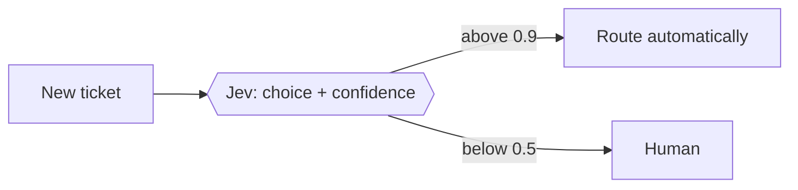

# Blocks the site renders — examples and pitfalls

Contents: code · tables · Mermaid · inline SVG · SVG image · what not to use

## Code

Always give the language after the fence; it drives Shiki highlighting and the label on the frame.

````md
```ts
export const add = (a: number, b: number) => a + b;
```
````

Supported: any language Shiki bundles (`ts`, `js`, `bash`, `json`, `sql`, `python`, `go`, `rust`,
`yaml`, `diff`, `text`…). Use `text` for pseudo-code or formulas. Inline code with backticks is fine;
to show a literal backtick inline, use double backticks: `` ` ``.

## Tables

Standard GFM. Keep cells short; wide tables scroll horizontally.

```md
| Confidence | Action |
|---|---|
| > 0.9 | act automatically |
```

## Mermaid

````md

````

- Rendered in the browser from a lazily loaded chunk, themed with the site colours; no build step.
- **Quote labels** that contain punctuation, commas, `+`, `<`, `>` or parentheses: `|"0,5 đến 0,9"|`,
  `{{"a + b"}}`. Unquoted special characters are the usual cause of a render error.
- Never put a backtick inside a Mermaid label.
- Prefer `flowchart LR` / `TD`, `sequenceDiagram`, `stateDiagram-v2`; each extra diagram type loads
  another chunk.
- A render error shows a red line above the raw code; check the page after writing.

## Inline SVG (hand-drawn diagram)

```html
<figure>
<svg viewBox="0 0 640 250" xmlns="http://www.w3.org/2000/svg" role="img" aria-labelledby="d1-title" font-family="ui-monospace, Menlo, monospace" font-size="13">
<title id="d1-title">One-sentence description for screen readers</title>
<rect x="20" y="20" width="150" height="60" rx="6" fill="var(--color-coffee-800)" stroke="var(--color-latte)"/>
<text x="95" y="55" fill="var(--color-foam)" text-anchor="middle">state</text>
</svg>
<figcaption>What the reader should take from the diagram, and where its numbers come from.</figcaption>
</figure>
```

- **No blank lines anywhere inside `<figure>…</figure>`**: markdown ends the HTML block at the first
  blank line and the rest is printed as text.
- Leave one blank line before `<figure>` and after `</figure>`.
- Use `viewBox`, not fixed `width`/`height`, so it scales; the frame caps it at the column width.
- Colours: `var(--color-foam)` (text), `var(--color-latte)` (secondary text, lines),
  `var(--color-crema)` (accent), `var(--color-matcha)` (positive), `var(--color-cherry)` (negative),
  `var(--color-coffee-800)` / `-850` / `-900` (box fills). They follow the site theme; hex values do not.
- Give every `aria-labelledby` id a unique name within the post.

## SVG image file

Put the file in `public/` (e.g. `public/posts/<id>/diagram.svg`) and reference it on its own line:

```md

```

It gets the same frame and full-screen button. An external SVG cannot use the site colour tokens, so
draw it for a dark background.

## What not to use

- An `#` heading in the body — the title comes from frontmatter.
- Raw `<script>` or `<style>` in markdown.
- Images hot-linked from other sites; copy them into `public/` with a source line in the caption.
