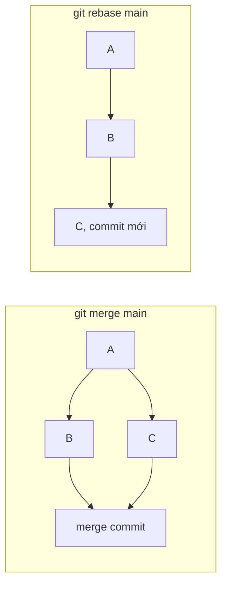

> Các lệnh dưới đây đã chạy thử trên git 2.52.0 (macOS), trong một repo và một remote tạo riêng để
> thử. Chưa chạy: `git add -p` (cần thao tác tay), `git rebase --continue` (cần một conflict thật),
> và các lệnh ghi "trên Windows".

## 1. Cài đặt lần đầu trên máy mới

Chạy một lần cho mỗi máy. `--global` ghi vào `~/.gitconfig`, nên áp dụng cho mọi repo trên máy.

```bash
git config --global user.name "Nguyễn Thành Trung"
git config --global user.email "trungnttb.dev@gmail.com"
git config --global init.defaultBranch main   # repo mới tạo dùng branch main
git config --global pull.rebase true          # git pull = fetch + rebase, không sinh merge commit thừa
git config --global --list                    # xem lại cấu hình hiện tại
```

Repo công ty cần email khác thì ghi đè riêng cho repo đó (bỏ `--global`):

```bash
git config user.email "trung@company.example"
```

## 2. Xuống dòng LF/CRLF giữa macOS và Windows

macOS và Linux kết thúc dòng bằng `LF`, Windows bằng `CRLF`. Nếu không quy định, một người Windows
sửa một dòng có thể làm diff đổi cả file. Cách chắc chắn nhất là đặt quy tắc **trong repo** bằng
`.gitattributes`, vì file này đi theo repo, không phụ thuộc cấu hình từng máy:

```text
# .gitattributes
* text=auto eol=lf
*.bat text eol=crlf
*.png binary
```

Kết quả khi thử với một file có `CRLF` (`git ls-files --eol`): trong index được lưu là LF
(`i/lf`), còn file trong thư mục làm việc vẫn giữ CRLF (`w/crlf`) cho tới lần git ghi lại file đó.

```bash
git ls-files --eol          # i/ = trong index, w/ = trong thư mục làm việc
git add --renormalize .     # áp quy tắc mới cho các file đã commit trước đó
```

Cấu hình thêm cho từng máy, làm lớp dự phòng khi repo chưa có `.gitattributes`:

```bash
git config --global core.autocrlf input   # macOS / Linux: đổi CRLF thành LF khi commit
git config --global core.autocrlf true    # trên Windows: checkout ra CRLF, commit vào LF
```

## 3. Bắt đầu một repo

```bash
git init my-app                                   # repo mới
git clone git@github.com:<user>/<repo>.git        # lấy repo có sẵn
git remote add origin git@github.com:<user>/my-app.git
git remote -v                                     # xem remote đang trỏ tới đâu
git push -u origin main                           # lần push đầu: -u gắn main với origin/main
```

## 4. Việc hằng ngày

```bash
git status --short
git diff                    # thay đổi chưa add
git diff --staged           # thay đổi đã add, sắp vào commit
git add -p                  # chọn từng đoạn thay đổi để add
git commit -m "feat: add login form"
git log --oneline --graph --all
```

Bỏ thay đổi, thay cho `git checkout -- file` kiểu cũ:

```bash
git restore --staged a.txt   # bỏ file khỏi staging, giữ nguyên nội dung đã sửa
git restore a.txt            # bỏ luôn nội dung đã sửa (không lấy lại được)
```

## 5. Đồng bộ với remote

```bash
git fetch --prune   # tải thay đổi mới, xoá các branch remote đã bị xoá trên server
git pull            # với pull.rebase=true: commit local được đặt lên sau commit mới của remote
git push
```

## 6. Branch và merge

```bash
git switch -c feature/login   # tạo branch mới và chuyển sang
git switch main
git switch -                  # quay lại branch vừa ở trước đó
git merge --no-ff feature/login -m "merge feature/login"  # luôn tạo merge commit, giữ dấu vết branch
git branch -d feature/login                               # xoá branch local đã merge
git push origin --delete feature/login                    # xoá branch trên remote
```

## 7. Merge hay rebase

Cả hai đều đưa thay đổi của `main` vào branch của bạn, nhưng lịch sử khác nhau:



- **merge** giữ nguyên các commit và thêm một merge commit. An toàn cho branch nhiều người dùng chung.
- **rebase** viết lại commit của bạn lên sau `main`, lịch sử thẳng hàng nhưng hash của các commit
  đó đổi. Chỉ rebase branch **chỉ mình bạn dùng**.

```bash
git switch feature/b
git rebase main          # đặt các commit của feature/b lên sau main
git rebase --continue    # sau khi sửa xong conflict
git rebase --abort       # huỷ, quay về trạng thái trước khi rebase
git merge --abort        # tương tự, khi đang merge dở
```

## 8. Cất tạm thay đổi với stash

Đang sửa dở mà phải chuyển sang việc khác:

```bash
git stash push -m "wip: form validation"
git stash list
git stash pop            # lấy lại thay đổi mới nhất và xoá khỏi danh sách stash
```

## 9. Sửa commit cuối, lấy lại branch xoá nhầm bằng reflog

```bash
git commit --amend -m "add y"      # sửa message hoặc thêm file vào commit cuối
git cherry-pick <hash>             # chép một commit từ branch khác sang branch hiện tại
git push --force-with-lease        # push lịch sử đã sửa; từ chối nếu remote có commit mới mà bạn chưa có
```

`--force-with-lease` an toàn hơn `--force`: nếu có người vừa push lên branch đó, lệnh bị từ chối
thay vì ghi đè commit của họ.

Xoá nhầm branch hoặc reset nhầm: commit vẫn còn trong reflog một thời gian. Tìm hash trước, rồi tạo
branch từ hash đó:

```bash
git reflog --format='%h %gs'       # tìm dòng có commit cần cứu, ví dụ "2ead9fe rebase (finish) ..."
git branch feature/b 2ead9fe       # tạo lại branch trỏ vào commit đó
```

Đừng dùng `HEAD@{0}` cho việc này: nó trỏ vào vị trí hiện tại của HEAD, thường là branch bạn đang
đứng, không phải commit đã mất.

## 10. Worktree: làm hai branch cùng lúc

Worktree cho phép check out một branch khác ra **một thư mục riêng**, dùng chung lịch sử với repo
chính. Không cần stash, không cần clone lần hai. Hợp với lúc đang làm dở feature thì phải sửa gấp
hotfix:

```bash
git worktree add ../app-hotfix -b hotfix/1   # thư mục mới, branch mới hotfix/1
cd ../app-hotfix
# sửa, commit, push như bình thường
cd -
git worktree list                            # xem các worktree đang có
git worktree remove ../app-hotfix            # xoá thư mục; branch hotfix/1 vẫn còn
```

Một branch chỉ được check out ở **một** worktree tại một thời điểm. Xoá worktree không xoá branch và
không xoá commit trong branch đó.
