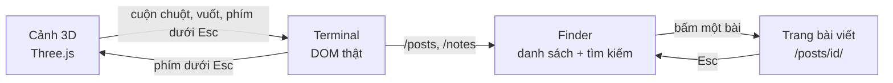
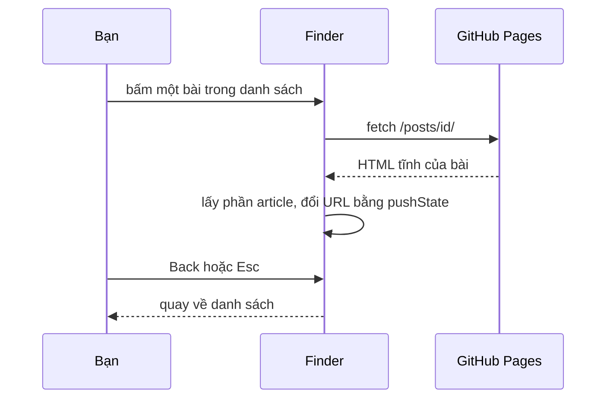
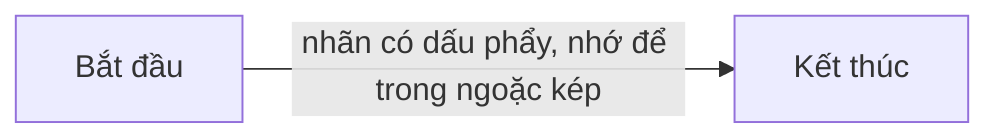

Bạn đang đọc bài này bên trong một terminal nằm trên màn hình laptop của một người ngồi bên bàn làm
việc. Bài viết đi qua từng phần của trang: cảnh 3D, cách chuyển sang terminal, cách nội dung được
build, và cuối cùng là các block bạn dùng được khi viết một bài mới.

> Mọi con số trong bài lấy từ repo này và từ lần `pnpm build` ngày 25/9/2026. Stack: Astro 7.3.5,
> Tailwind CSS 4.3.3, Three.js 0.186.1, Shiki 4.4.3, satori 0.33.5, pnpm 12.6.0, Node 24.

## Toàn cảnh: một site tĩnh, ba phần

Toàn bộ trang được build thành file tĩnh trong `dist/`, không cần server. Trang gồm ba phần, làm
theo đúng thứ tự dưới đây. Phần thứ nhất chạy được một mình, và là bản dự phòng khi máy không chạy
được WebGL.



## Cảnh 3D: bàn làm việc dựng bằng code

Người ngồi, cái bàn, MacBook, cốc cafe có hơi nước, đèn bàn và chậu cây đều được dựng bằng các khối
hộp trong `src/scene/model.ts`, chưa dùng file model nào. Code camera và ánh sáng chỉ tìm model qua
vài tên node cố định:

| Node | Dùng để |
|---|---|
| `Screen` | màn hình laptop, là đích camera bay tới |
| `Mug` | cốc cafe, gắn hiệu ứng hơi nước |
| `Desk` | mặt bàn, nhận bóng đổ |

Nhờ vậy, sau này thay bằng một file `.glb` vẽ bằng MagicaVoxel thì chỉ cần giữ đúng các tên này.
Trên mặt bàn có khắc domain `trungnttb.dev`. Kéo ngang để xoay cảnh; khi bắt đầu zoom, góc xoay tự
trả dần về 0 để camera không bay xuyên qua người hay bàn.

## Ánh sáng theo giờ của người xem

Trang đọc giờ trên máy bạn và chọn một trong bốn bộ ánh sáng. Quanh mỗi mốc giờ, ánh sáng chuyển dần
trong 30 phút (15 phút trước, 15 phút sau), nên để tab mở qua 18:00 thì cảnh tối dần từ 17:45 tới
18:15.

<figure>
<svg viewBox="0 0 640 120" xmlns="http://www.w3.org/2000/svg" role="img" aria-labelledby="day-title" font-family="ui-monospace, Menlo, monospace" font-size="12">
<title id="day-title">Bốn mức ánh sáng trong 24 giờ: tối 0–5 giờ, sáng sớm 5–7, buổi sáng 7–12, buổi chiều 12–18, tối 18–24</title>
<rect x="20" y="30" width="125" height="40" fill="var(--color-coffee-800)" stroke="var(--color-latte)"/>
<rect x="145" y="30" width="50" height="40" fill="var(--color-crema)" opacity="0.55"/>
<rect x="195" y="30" width="125" height="40" fill="var(--color-foam)" opacity="0.85"/>
<rect x="320" y="30" width="150" height="40" fill="var(--color-crema)" opacity="0.85"/>
<rect x="470" y="30" width="150" height="40" fill="var(--color-coffee-800)" stroke="var(--color-latte)"/>
<g fill="var(--color-foam)" text-anchor="middle"><text x="82" y="55">tối</text><text x="170" y="20">sáng sớm</text><text x="545" y="55">tối</text></g>
<g fill="var(--color-coffee-950)" text-anchor="middle"><text x="257" y="55">buổi sáng</text><text x="395" y="55">buổi chiều</text></g>
<g fill="var(--color-latte)" text-anchor="middle"><text x="20" y="90">0h</text><text x="145" y="90">5h</text><text x="195" y="90">7h</text><text x="320" y="90">12h</text><text x="470" y="90">18h</text><text x="620" y="90">24h</text></g>
</svg>
<figcaption>Bốn mức ánh sáng theo giờ trên máy người xem; mốc giờ lấy từ BOUNDARIES trong src/scene/lighting.ts.</figcaption>
</figure>

Phép chuyển dần là một phép nội suy thuần, không phụ thuộc Three.js, nên có unit test riêng. Hàm
chính trong `src/scene/lighting.ts`:

```ts
export function lightingAt(date: Date): LightingParams {
  const minutes = date.getHours() * HOUR + date.getMinutes() + date.getSeconds() / 60;
  const { from, to, t } = blendAt(minutes);
  return lerpParams(PRESETS[from], PRESETS[to], t);
}
```

Muốn xem thử các buổi khác, bấm đồng hồ ở góc trên bên phải màn 3D. Mỗi lần bấm, cảnh chuyển sang
mức kế tiếp: 06:00, 09:30, 15:00, 21:00. Nút **Auto** quay về theo giờ máy. Lựa chọn được lưu trong
`localStorage` với key `portfolio.timeOfDay`.

## Từ cảnh 3D vào terminal

Có bốn cách chuyển, và cả bốn gọi cùng một hàm:

- **Cuộn chuột** trên desktop hoặc **vuốt lên** trên điện thoại. Mỗi đơn vị cuộn đẩy tiến độ zoom
  thêm 0,0012. Dừng tay 450 ms mà tiến độ đã quá 0,3 thì camera tự bay nốt vào màn hình; chưa tới
  0,3 thì tự lùi về vị trí đầu.
- **Phím `` ` ``** (ngay dưới Esc, không cần Shift): bay thẳng vào trong 1,3 giây; nhấn lần nữa để
  quay ra. Phím này luôn chuyển cảnh, kể cả khi đang gõ lệnh.
- **Nút hình phím `` ` ``** ở góc dưới bên phải, cho màn hình cảm ứng.

Camera bay theo một đường cong qua vai nhân vật tới trước màn hình, ở khoảng cách mà màn hình lấp
kín khung nhìn. Khoảng cách đó tính bằng hàm trong `src/scene/framing.ts`:

```ts
export function coverDistance(screenWidth: number, screenHeight: number, verticalFovDeg: number, aspect: number): number {
  const tanHalf = Math.tan((verticalFovDeg * Math.PI) / 360);
  const byHeight = screenHeight / 2 / tanHalf;
  const byWidth = screenWidth / 2 / (tanHalf * aspect);
  return Math.min(byHeight, byWidth) * 0.97;
}
```

Khi tới nơi, terminal HTML hiện lên đè canvas trong 280 ms. Màn hình laptop trong cảnh 3D tô đúng
màu nền `#1a1110` của terminal, nên bạn gần như không thấy chỗ chuyển.

## Terminal: năm lệnh

| Lệnh | In ra |
|---|---|
| `/help` | danh sách lệnh và mẹo phím tắt |
| `/me` | giới thiệu, bio, link |
| `/work` | stack công nghệ và quá trình làm việc |
| `/posts` | mở Finder với các bài dài |
| `/notes` | mở Finder với các note: script, lệnh hay dùng |

Gõ lệnh hoặc bấm lệnh trên thanh phía trên đều chạy như nhau. `↑`/`↓` gọi lại lệnh đã gõ, `Tab` tự
điền lệnh, và gõ sai thì in `command not found` giống một shell thật.

## Finder: danh sách bài, tìm kiếm và mở bài

Finder tìm trên tiêu đề, tóm tắt và tag. Tìm không phân biệt dấu, nên gõ `tieng viet` vẫn ra
`Tiếng Việt`. Mỗi bài có URL riêng dạng `/posts/<id>/`, được build sẵn thành HTML tĩnh:



Mở thẳng link một bài (ví dụ ai đó gửi cho bạn) thì trang vào luôn terminal với bài đó mở sẵn, và
không tải Three.js. Cảnh 3D chỉ được tải khi bạn nhấn `` ` ``.

## Trang bài viết

- **Mục lục** tự sinh khi bài có từ 3 mục `##` trở lên. Màn hình rộng từ 1200px thì mục lục là cột
  bên phải, đi theo khi cuộn và tô sáng mục đang đọc.
- **Code** được tô màu lúc build bằng Shiki, theme `gruvbox-dark-medium`, và có nút Copy.
- **Diagram** Mermaid và SVG đều có nút xem toàn màn hình.
- **Chia sẻ**: nút Share (Web Share API, chỉ hiện khi trình duyệt hỗ trợ), Copy link, X, Facebook,
  LinkedIn.

## Ảnh xem trước khi chia sẻ link

Mỗi bài có một ảnh 1200×630 sinh lúc build bằng satori và resvg, nằm ở `/og/<collection>/<id>.png`.
Có một cái bẫy: nếu nạp các subset font tiếng Việt của fontsource dưới **cùng một tên font**, ảnh mất
hết chữ có dấu mà build không báo lỗi. Cách làm đúng là đặt tên riêng cho từng subset rồi xếp thành
font stack:

```ts
const SUBSETS = ['latin', 'latin-ext', 'vietnamese'] as const;
const FONT_STACK = SUBSETS.map((subset) => `JBM ${subset}`).join(', ');
```

Ở lần build ngày 25/9, ảnh đầu tiên mất khoảng 1,5 giây (khởi tạo WASM), các ảnh sau khoảng
90–140 ms mỗi ảnh.

## Build và deploy

| Phần | Kích thước | Sau gzip | Khi nào tải |
|---|---|---|---|
| JS của trang | 29,5 KB | 11,5 KB | luôn luôn |
| CSS | 26,7 KB | 6,5 KB | luôn luôn |
| Three.js và cảnh 3D | 545 KB | 136 KB | khi hiện cảnh 3D |
| Mermaid | nhiều chunk | — | khi bài có diagram |

Mỗi lần push lên `main`, GitHub Actions chạy `pnpm test && pnpm build` rồi đưa `dist/` lên GitHub
Pages. Test fail thì không deploy.


## Các block dùng được khi viết bài

Phần này là bảng tra nhanh: mỗi mục là một block, kèm cách viết trong markdown.

### Chữ, link và code ngắn

Viết **đậm**, *nghiêng*, [link](https://github.com/trungnttb) và `code ngắn` như markdown bình
thường. Muốn hiện dấu `` ` `` trong code ngắn thì bọc bằng hai dấu backtick: ``` `` ` `` ```.

### Danh sách

- danh sách gạch đầu dòng
- dòng thứ hai

1. danh sách đánh số
2. dòng thứ hai

### Trích dẫn

> Dùng `>` ở đầu dòng. Hợp cho ghi chú về nguồn hoặc ngày cập nhật.

### Code block có nút Copy

Ghi tên ngôn ngữ sau ba dấu backtick: `ts`, `bash`, `json`, `sql`, `yaml`, `diff`, `text`…

```bash
pnpm dev     # chạy dev server
pnpm build   # build ra dist/
```

### Bảng

```md
| Cột A | Cột B |
|---|---|
| 1 | 2 |
```

### Diagram Mermaid

````md

````

Nhãn có dấu phẩy, `+`, `<`, `>` hay ngoặc thì để trong ngoặc kép. Diagram render trên trình duyệt,
và thư viện Mermaid chỉ được tải khi bài có diagram.

### SVG vẽ tay trong bài

```html
<figure>
<svg viewBox="0 0 640 120" xmlns="http://www.w3.org/2000/svg" role="img" aria-labelledby="my-title">
<title id="my-title">Mô tả ngắn cho trình đọc màn hình</title>
<rect x="20" y="20" width="150" height="60" rx="6" fill="var(--color-coffee-800)" stroke="var(--color-latte)"/>
</svg>
<figcaption>Chú thích cho diagram.</figcaption>
</figure>
```

Không để dòng trống nào bên trong `<figure>`: markdown kết thúc khối HTML ở dòng trống đầu tiên. Tô
màu bằng biến CSS của site (`var(--color-foam)`, `--color-crema`, `--color-latte`,
`--color-matcha`…) để diagram khớp theme. Diagram giờ trong ngày ở phần ánh sáng phía trên được
viết theo cách này.

### Ảnh SVG từ file

```md

```

Đặt file trong `public/posts/<id>/`. Ảnh request ở phần build phía trên dùng cách này. File SVG
ngoài không đọc được biến CSS của site, nên vẽ sẵn cho nền tối.

### Mục lục

Không cần viết gì: có từ 3 mục `##` trở lên là mục lục tự hiện. Tiêu đề mục nên đọc riêng vẫn hiểu,
vì nó chính là dòng trong mục lục.

### Frontmatter

```yaml
---
title: "Tiêu đề, nhớ để trong ngoặc kép nếu có dấu hai chấm"
summary: 1–2 câu, hiện trong danh sách và trong ảnh xem trước khi chia sẻ
date: 2026-09-25
tags: [astro, threejs]
---
```

Note dùng `description` thay cho `summary` và có thêm `lang`. Muốn nhờ AI viết bài theo đúng các quy
tắc này, dùng skill `writing-posts` có sẵn trong repo.
