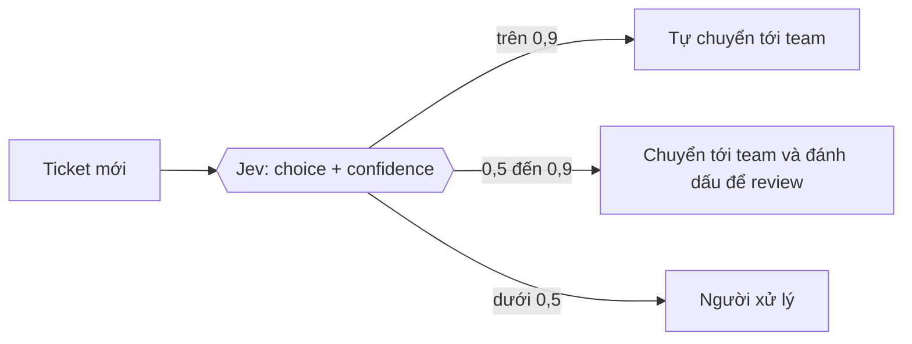

Hầu hết code gọi LLM trong production không cần một đoạn văn. Code cần biết ticket này thuộc team nào,
review này có nhắc tới hoàn tiền không, lỗi này nghiêm trọng tới mức nào. Để có được câu trả lời
đó, ta viết prompt dặn model "chỉ trả JSON", parse chuỗi trả về, rồi xử lý khi model trả thừa một
câu giải thích hoặc đặt sai tên field.

Jev là một mô hình được thiết kế riêng cho loại việc này. Nó không sinh chữ. Bạn đưa vào một đoạn
văn bản và một danh sách câu hỏi có kiểu, nó trả về lựa chọn, điểm số hoặc xác suất kèm độ tin
cậy, và các giá trị đó luôn thuộc tập giá trị bạn đã khai báo.

> Bài này tổng hợp từ tài liệu chính thức của TypeSafe và các bài viết độc lập, cập nhật đến ngày
> 25/9/2026. Mình chưa gọi API thật. Các con số về tốc độ và giá là số do TypeSafe tự công bố,
> chưa có bên thứ ba đo lại.

## Jev là gì, ai làm ra

Jev là mô hình đầu tiên của **TypeSafe AI**, một phòng lab ở San Francisco. Công ty ra khỏi
stealth ngày 15/9/2026 với vòng seed 40 triệu USD do DCVC dẫn đầu. Forbes dẫn lời một người biết
về thương vụ cho biết mức định giá là 200 triệu USD.

Người sáng lập là **Diogo Almeida**, từng làm nghiên cứu ở OpenAI và tham gia phát triển RLHF và
ChatGPT. Hai người đồng sáng lập là Erik Gafni và Sasha Sheng. Tên "Jev" lấy từ *Nghịch lý Jevons*:
khi một tài nguyên rẻ đi thì người ta dùng nó nhiều hơn chứ không ít đi. Đó cũng là điều TypeSafe
muốn xảy ra với việc gọi AI trong phần mềm.

Hiện Jev chỉ mở dạng early access: developer đăng ký waitlist rồi được cấp quyền dần. Model mặc định
khi gọi API là `jev-latest`. Response mẫu trong tài liệu API trả về `jev-1.13.0`.

## "System One model" nghĩa là gì

TypeSafe gọi Jev là một **System One model**. Tên này lấy từ cách chia của Daniel Kahneman: hệ 1
phán đoán nhanh và gần như tức thời, hệ 2 suy luận chậm và có chủ ý. LLM làm tốt việc của hệ 2:
viết, giải thích, suy luận nhiều bước. Jev chỉ nhắm vào hệ 1: những quyết định hẹp, lặp lại hàng
nghìn lần, cần nhanh và rẻ.

Theo blog giới thiệu của TypeSafe, Jev khác LLM ở ba điểm:

| | LLM thông thường | Jev |
|---|---|---|
| Cách sinh output | từng token nối tiếp nhau (autoregressive) | trả lời mọi câu hỏi trong **một lượt tính song song** |
| Kiểu output | chuỗi ký tự, muốn có JSON thì phải parse | giá trị có kiểu kèm xác suất, không bao giờ là chuỗi tự do |
| Cách huấn luyện | RLHF / RLVR | TypeSafe gọi là *Reinforcement Learning for Calibrated Decisions* (RLCD) |

<figure>
<svg viewBox="0 0 640 250" xmlns="http://www.w3.org/2000/svg" role="img" aria-labelledby="gen-title" font-family="ui-monospace, Menlo, monospace" font-size="13">
<title id="gen-title">LLM sinh từng token nối tiếp; Jev trả lời mọi câu hỏi trong một lượt</title>
<text x="20" y="30" fill="var(--color-crema)" font-weight="700">LLM: từng token, lượt sau chờ lượt trước</text>
<g fill="var(--color-coffee-800)" stroke="var(--color-latte)">
<rect x="20" y="46" width="70" height="34" rx="5"/><rect x="120" y="46" width="70" height="34" rx="5"/><rect x="220" y="46" width="70" height="34" rx="5"/><rect x="320" y="46" width="70" height="34" rx="5"/><rect x="420" y="46" width="200" height="34" rx="5"/>
</g>
<g fill="var(--color-foam)" text-anchor="middle">
<text x="55" y="68">{"</text><text x="155" y="68">dept</text><text x="255" y="68">":</text><text x="355" y="68">"bill</text><text x="520" y="68">… rồi parse chuỗi JSON</text>
</g>
<g stroke="var(--color-latte)" stroke-width="1.5"><line x1="90" y1="63" x2="120" y2="63"/><line x1="190" y1="63" x2="220" y2="63"/><line x1="290" y1="63" x2="320" y2="63"/><line x1="390" y1="63" x2="420" y2="63"/></g>
<text x="20" y="130" fill="var(--color-matcha)" font-weight="700">Jev: một lượt tính, mọi câu trả lời cùng lúc</text>
<rect x="20" y="146" width="150" height="84" rx="6" fill="var(--color-coffee-800)" stroke="var(--color-latte)"/>
<text x="95" y="184" fill="var(--color-foam)" text-anchor="middle">state +</text><text x="95" y="202" fill="var(--color-foam)" text-anchor="middle">questions</text>
<g stroke="var(--color-matcha)" stroke-width="1.5"><line x1="170" y1="188" x2="260" y2="158"/><line x1="170" y1="188" x2="260" y2="188"/><line x1="170" y1="188" x2="260" y2="218"/></g>
<g fill="var(--color-coffee-800)" stroke="var(--color-matcha)"><rect x="260" y="144" width="360" height="26" rx="5"/><rect x="260" y="175" width="360" height="26" rx="5"/><rect x="260" y="206" width="360" height="26" rx="5"/></g>
<g fill="var(--color-foam)"><text x="272" y="162">is_urgent   noul   0.95</text><text x="272" y="193">department  choice billing (0.88)</text><text x="272" y="224">frustration score  1.05</text></g>
</svg>
<figcaption>LLM phải sinh từng token rồi mới parse được JSON; Jev trả về giá trị có kiểu cho mọi câu hỏi trong một lượt. Số liệu lấy từ response mẫu trong API reference.</figcaption>
</figure>

Vì output luôn nằm trong tập giá trị đã khai báo, TypeSafe tuyên bố Jev có **0% lỗi kiểu**: không
thể trả về một lựa chọn không có trong danh sách. Cần hiểu đúng giới hạn của tuyên bố này. Nó chỉ
đảm bảo output đúng kiểu, không đảm bảo output đúng. Jev vẫn có thể chọn sai team.

## Ba loại câu hỏi

Mọi thứ Jev trả lời đều thuộc một trong ba loại, TypeSafe gọi chúng là *primitive*:

### Noul: câu hỏi đúng/sai

`noul` là xác suất từ 0 đến 1 cho một mệnh đề đúng/sai, ví dụ "tin nhắn này có yêu cầu hoàn tiền
không?". Response chỉ có một con số.

### Choice: chọn một trong nhiều

`choice` chọn một phương án trong danh sách bạn định nghĩa, tối đa **255 phương án**. Response gồm
phương án được chọn, xác suất của từng phương án, và `confidence`.

### Score: đặt lên một thang mức

`score` xếp nội dung lên một thang có thứ tự từ **2 đến 10 mức**, mỗi mức có mô tả riêng. Response
trả về điểm là trung bình có trọng số theo xác suất (có thể là số lẻ như `1.05`), kèm `legend` để
tra ngược từ số ra mô tả của từng mức.

## Một request thật trông như thế nào

API chỉ có một endpoint: `POST https://api.typesafe.ai/v1/systemone`, xác thực bằng header
`Authorization: Bearer <API_KEY>`. Dưới đây là request mẫu trong API reference, hỏi ba câu cùng
lúc về một tin nhắn hỗ trợ:

```json
{
  "state": "Help! My payouts have been failing for 3 days.",
  "model": "jev-latest",
  "questions": {
    "is_urgent": {
      "type": "noul",
      "instructions": "Does this convey urgency?",
      "criteria": {
        "true": "Explicitly time-sensitive",
        "false": "No urgency expressed"
      }
    },
    "department": {
      "type": "choice",
      "instructions": "Which team should handle this?",
      "criteria": {
        "billing": "Payments, invoicing, refunds",
        "technical": "Bugs, outages, integrations",
        "sales": "Pricing, upgrades, new accounts"
      }
    },
    "frustration": {
      "type": "score",
      "instructions": "How frustrated is the customer?",
      "criteria": ["Calm", "Frustrated", "Very angry"]
    }
  }
}
```

Và response mẫu:

```json
{
  "model": "jev-1.13.0",
  "answers": {
    "is_urgent": { "type": "noul", "noul": 0.95 },
    "department": {
      "type": "choice",
      "choice": "billing",
      "probabilities": { "billing": 0.88, "technical": 0.12, "sales": 0.0 },
      "confidence": 0.81
    },
    "frustration": {
      "type": "score",
      "score": 1.05,
      "legend": { "0": "Calm", "1": "Frustrated", "2": "Very angry" },
      "probabilities": { "0": 0.0, "1": 0.95, "2": 0.05 },
      "confidence": 0.92
    }
  },
  "usage": { "input_tokens": 304, "output_tokens": 18 }
}
```

Hai điểm đáng chú ý. Thứ nhất, `state` là văn bản bất kỳ: log, ticket, một đoạn JSON đã
stringify. Thứ hai, `criteria` là nơi bạn viết định nghĩa cho từng phương án. Các định nghĩa này
càng rõ ràng và không chồng lên nhau thì kết quả càng tốt.

Gọi từ TypeScript thì chỉ cần `fetch`. Đoạn dưới dựa trên request mẫu ở trên. Kiểu dữ liệu mình
tự khai báo theo các field trong API reference, không lấy từ SDK chính thức:

```ts
type ChoiceAnswer = {
  type: 'choice';
  choice: string;
  probabilities: Record<string, number>;
  confidence: number;
};

async function routeTicket(ticket: string): Promise<ChoiceAnswer> {
  const response = await fetch('https://api.typesafe.ai/v1/systemone', {
    method: 'POST',
    headers: {
      Authorization: `Bearer ${process.env.TYPESAFE_API_KEY}`,
      'Content-Type': 'application/json',
    },
    body: JSON.stringify({
      state: ticket,
      model: 'jev-latest',
      questions: {
        department: {
          type: 'choice',
          instructions: 'Which team should handle this?',
          criteria: {
            billing: 'Payments, invoicing, refunds',
            technical: 'Bugs, outages, integrations',
            sales: 'Pricing, upgrades, new accounts',
          },
        },
      },
    }),
  });
  if (!response.ok) throw new Error(`TypeSafe API ${response.status}`);
  const { answers } = await response.json();
  return answers.department as ChoiceAnswer;
}
```

TypeSafe có SDK Python (`pip install typesafe-sdk`, cần Python 3.10 trở lên) và SDK JavaScript.
Họ cũng có một skill cho Claude Code, cài bằng hai lệnh:

```bash
claude plugin marketplace add typesafe-ai/skills
claude plugin install typesafe@typesafe-ai
```

## Probability và confidence khác nhau thế nào

Hai khái niệm này dễ bị nhầm với nhau:

- **`probabilities`** là phân bố xác suất trên các phương án (với Choice) hoặc các mức (với Score).
- **`confidence`** là một con số từ 0 đến 1, cho biết phân bố đó dồn vào một phương án tới mức nào.
  Dồn hết vào một phương án thì confidence cao; chia đều cho các phương án thì confidence thấp.

Với câu hỏi có ba phương án, tài liệu đưa ra công thức xấp xỉ:

```text
confidence = (3 × xác suất lớn nhất − 1) / 2
```

Thử với response ở trên: câu `department` có xác suất lớn nhất 0,88, công thức cho 0,82, response
ghi 0,81. Câu `frustration` có xác suất lớn nhất 0,95, công thức cho 0,925, response ghi 0,92. Hai
cặp số khớp nhau trong phạm vi xấp xỉ mà tài liệu đã nói.

TypeSafe khuyên dùng confidence để quyết định có tự động hành động hay không, chia làm ba khoảng:

| Confidence | Nên làm gì |
|---|---|
| > 0,9 | Tự động xử lý, không cần người kiểm tra |
| 0,5 – 0,9 | Xử lý thận trọng: hỏi lại người dùng, đánh dấu để review |
| < 0,5 | Không tự xử lý: chuyển cho người, hoặc dùng hệ thống khác |

Áp vào ví dụ định tuyến ticket, luồng xử lý trông như sau:



Tài liệu cũng lưu ý một điều quan trọng: ngưỡng confidence không phải là một con số dùng chung cho
cả hệ thống. Hành động nào gây hậu quả lớn khi sai thì đặt ngưỡng cao hơn. Tự gắn tag có thể chạy ở
0,6; tự hoàn tiền thì nên đòi trên 0,95.

## Nhanh và rẻ tới mức nào

Toàn bộ số liệu dưới đây do TypeSafe tự công bố:

- **Độ trễ:** 70–500 ms cho mỗi request, phần lớn khoảng 100 ms.
- **Giá:** 0,042 USD cho mỗi triệu token input. Token output không tính tiền. Để so sánh, giá input
  của các LLM mà TypeSafe đưa ra nằm trong khoảng 0,20–10 USD mỗi triệu token.
- **So với LLM:** các nguồn đưa ra con số khác nhau. Thông cáo báo chí viết "tới 100 lần nhanh hơn
  và rẻ hơn". Blog viết "nhanh hơn 40–200 lần" với các câu hỏi dạng System One. Trang chủ viết
  "nhanh hơn 193,6 lần, rẻ hơn 444,6 lần" trên bộ eval workflow của chính họ.

Chính TypeSafe cũng thừa nhận bộ eval workflow do team capability của họ viết, nên có thể thiên
về phía Jev. Khi đọc các con số này, nên nhớ chúng đo trên đúng loại việc Jev được thiết kế để
làm: phân loại, chấm điểm, định tuyến. Chúng không cho biết Jev "thông minh hơn" LLM nói chung.

Một bài viết độc lập ghi lại kết quả do một người dùng báo: phân loại 1.018 bài báo khoa học hết
0,08 USD, median 256 ms mỗi request. Tác giả bài đó cũng nói rõ đây là số người dùng tự báo, không
phải số tác giả đo.

## Jev làm kém ở đâu

TypeSafe có một trang riêng liệt kê điểm yếu của Jev 1.13. Việc công ty tự công khai danh sách này
đáng ghi nhận. Những điểm cần nhớ nhất:

1. **Đọc theo đúng chữ:** Jev hiểu instruction đúng như câu chữ, không đoán ý ngầm. Điều kiện bạn
   không viết ra thì nó không áp dụng.
2. **Không đếm được:** đếm ký tự trong một từ, đếm số lần một từ xuất hiện, đếm phần tử của một
   danh sách dài, đều không tin cậy được.
3. **Không so sánh được số và ngày:** Jev đọc ngày tháng như văn bản, nên sắp xếp ngày, tính khoảng
   thời gian hay so hai mã màu hex đều sai nhiều.
4. **Suy luận nhiều bước và phủ định kép:** độ chính xác giảm khi câu hỏi phải suy qua nhiều bước.
5. **State dài nhưng không liên quan:** độ chính xác giảm khi state chứa nhiều nội dung không liên
   quan tới quyết định.
6. **Prompt injection:** state chứa câu lệnh cài cắm có thể làm lệch câu trả lời.
7. **Xác suất không nhất quán giữa các câu hỏi:** không có gì đảm bảo P(A) + P(không A) = 1. Tài
   liệu đưa ví dụ: hỏi cùng một ý theo hai cách phủ định nhau, hai xác suất cộng lại được 1,19.
8. **Không sinh chữ:** ép Jev viết thì kết quả kém, vì nó không được huấn luyện cho việc đó.

Điểm 2 và 3 dẫn tới một nguyên tắc thiết kế rõ ràng: phần nào code làm được chính xác, như đếm, so
sánh ngày, tính toán, thì để code làm. Chỉ đưa cho Jev phần cần hiểu ngôn ngữ.

## Nên đặt Jev ở đâu trong hệ thống

Tài liệu "How to build with TypeSafe" tóm lại trong một câu: *code giữ quyền điều khiển, Jev chỉ
nhận những quyết định hẹp*. Một vài pattern tài liệu đưa ra:

- **Intent routing:** phân loại yêu cầu rồi đưa tới handler phù hợp. Đây là ví dụ ticket ở trên.
- **Confidence-gated routing:** dùng confidence làm trục quyết định, confidence cao thì tự xử lý,
  thấp thì chuyển cho người.
- **Composite scoring:** thay vì hỏi một câu mơ hồ như "ticket này có quan trọng không", tách thành
  nhiều câu score nhỏ (mức độ khẩn cấp, ảnh hưởng tới doanh thu, mức giận dữ) rồi tự tính trọng số
  trong code.
- **Speculative fan-out:** vì mọi câu hỏi được trả lời song song trong cùng một request, có thể hỏi
  thêm những câu *có thể* cần về sau mà gần như không tốn thêm thời gian.

Jev cũng dùng được cạnh một coding agent. Tài liệu nói rõ Jev **không** thay thế được LLM chạy sau
Claude Code hay Cursor, vì nó không viết code, không gọi tool, không sửa file. Cách dùng hợp lý là
nhờ coding agent viết code gọi Jev, hoặc dùng Jev làm một bước rẽ nhánh rẻ bên trong một pipeline
agent: chọn skill trong danh mục (cookbook của họ có ví dụ chọn trong 182 skill), chấm review, hay
lọc output của LLM trước khi gửi cho người dùng.

## Khi nào nên dùng, khi nào không

Nên cân nhắc Jev khi:

- Cùng một quyết định lặp lại rất nhiều lần, và câu trả lời thuộc một tập giá trị cố định.
- Độ trễ quan trọng, ví dụ quyết định nằm trên đường xử lý request của người dùng.
- Bạn cần một con số để đặt ngưỡng tự động, chứ không phải một đoạn giải thích.
- Bạn đang tốn nhiều công parse và validate JSON do LLM trả về.

Chưa nên dùng khi:

- Output cần là văn bản: tóm tắt, trả lời khách hàng, sinh code.
- Quyết định cần tính toán, đếm, hoặc so sánh ngày tháng. Việc này nên làm bằng code.
- Input là ảnh, âm thanh hoặc video. Hiện Jev chỉ nhận văn bản.
- Bạn cần chạy on-premise, hoặc cần SLA rõ ràng. Hiện Jev mới ở giai đoạn early access.

## Còn những gì chưa rõ

Tới ngày viết bài, còn vài điểm mình chưa tìm được câu trả lời:

- Giới hạn độ dài `state` và số câu hỏi tối đa trong một request. API reference chỉ nêu tối đa 255
  phương án cho Choice và 2–10 mức cho Score.
- Rate limit và giá chính thức sau giai đoạn early access.
- Kết quả benchmark do bên thứ ba độc lập đo.
- Kiến trúc cụ thể bên trong, ngoài hai điều đã công bố là non-autoregressive và huấn luyện bằng
  RLCD.

## Nguồn

- TypeSafe AI, [Introducing System One Models & Jev](https://typesafe.ai/blog/introducing-system-one-models-and-jev)
- TypeSafe Docs: [Quick start](https://docs.typesafe.ai/introduction/quickstart),
  [API reference](https://docs.typesafe.ai/api), [Confidence](https://docs.typesafe.ai/confidence),
  [Jev with coding agents](https://docs.typesafe.ai/introduction/coding-agents),
  [Jev 1.13 jaggedness](https://docs.typesafe.ai/model-jaggedness/jev-1.13)
- Business Wire qua Morningstar, [TypeSafe AI Emerges From Stealth With $40M in Funding](https://www.morningstar.com/news/business-wire/20260915525333/typesafe-ai-emerges-from-stealth-with-40m-in-funding-with-new-model-for-composable-ai)
- Forbes, [TypeSafe AI Raises $40 Million Seed Funding At $200 Million Valuation](https://www.forbes.com/sites/the-prompt/2026/09/15/this-200-million-startup-wants-to-fix-ais-overconfidence-problem/)
- SiliconANGLE, [TypeSafe AI exits stealth with $40M](https://siliconangle.com/2026/09/16/typesafe-ai-exits-stealth-with-40m-to-build-ai-for-use-by-software/)
- Flavio Copes, [A deep dive into Jev](https://flaviocopes.com/jev/)
